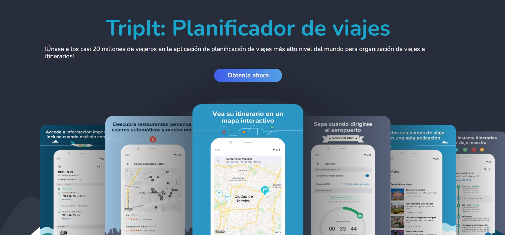
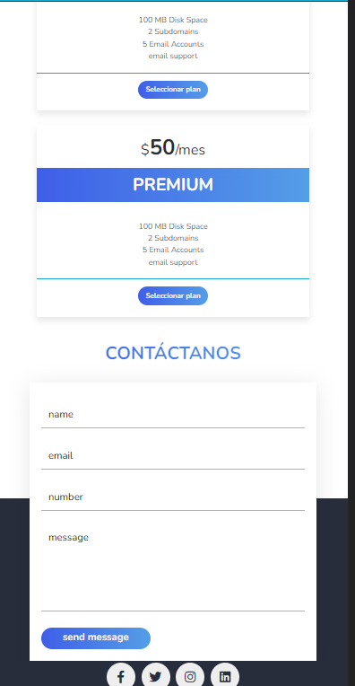

# TripIt: Planificador de Viajes

## Descripción del Proyecto
TripIt es un simple proyecto de página web que intenta simular una posible aplicación de planificación de viajes. El objetivo de esta página web es brindar a los usuarios una interfaz intuitiva y atractiva para planificar y organizar sus viajes de manera eficiente.

El proyecto utiliza HTML, CSS y JavaScript para construir una interfaz de usuario interactiva y responsiva. Incluye varias secciones como "Acerca de nosotros", "Nuestros Servicios", "Características", "Opiniones de Clientes" y "Contáctanos".

## Capturas de Pantalla

Captura de pantalla 1
***

 
Captura de pantalla 2
***

 
## Tecnologías Utilizadas
- HTML
- CSS
- JavaScript
## Instrucciones de Uso
- Clona este repositorio en tu máquina local.
- Abre el archivo index.html en tu navegador web.
- Funcionalidades Principales
- Navegación intuitiva y fácil de usar.
- Página web responsiva para dispositivos móviles y de escritorio.
- Secciones informativas sobre la aplicación y sus características.
- Reseñas y testimonios de clientes satisfechos.
- Formulario de contacto para que los usuarios se pongan en contacto con el equipo de soporte.